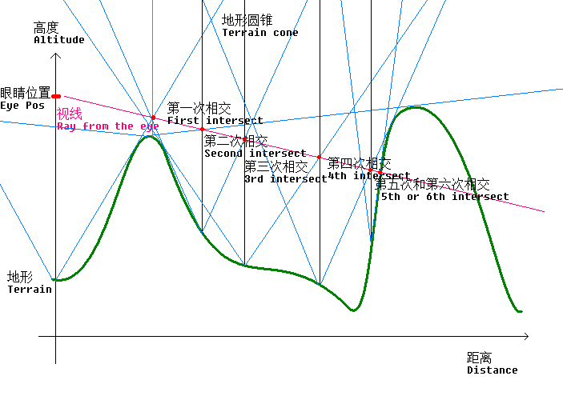

# 使用 Visual Basic 6.0 编写的纯 CPU 实时光追渲染地形图

## 语言 Language

简体中文 | [English](Readme.md)

## 介绍

Raymarch 光追技术是一种对每个像素，计算出视线方向，然后进行有限次数的循环步进方式去计算视线与 **置换纹理** （displacement texture）所表达的高度图的相交点，在图形学上用于简易光线追踪方案。

由于这个算法的复杂度可以被优化得很低，即使是古老的编程语言 Visual Basic 6.0，也能仅依赖纯 CPU 进行流畅的实时光追渲染。

这种光追算法仅用于计算视线与物体的相交点，不提供物理光学计算（漫反射统计等），是一种取代传统三角面几何的新渲染方式。

## 特性
* 使用线程池进行渲染。
* 没有使用任何 SIMD 加速指令集，纯 VB6 原生单精度浮点数计算。
* 键鼠交互：W/A/S/D 移动，空格跳跃。
* 画面渲染方式为 Raymarch 光追渲染，但是着色模型为传统 N·L 方式着色。
* 无限重复的地图大小，没有边界。
* 支持配置文件配置渲染参数等。
* 按一下 P 键自动开始录屏到 record.avi 文件里，再按一下 P 键结束录屏。
  * 录屏时长有限，录屏得到的 AVI 文件未经压缩，体积很大，慎用这个功能。

## Raymarch 光追

Raymarch 光追算法使用多种方式来计算视线向量的步进量，针对特定几何体可以使用针对几何体设计的 SDF （Signed Distance Function）函数来计算距离值，遍历整个场景的所有几何体，选择最小步进值进行步进。

我们当前的代码示例用的是别的算法：针对 Displacement 贴图进行的相交计算。Displacement 贴图的每个像素表达的是该点距离平面的高度值。

针对 Displacement 如何设计合理的步进值呢？最无脑的算法就是固定一个步进值，然后判断视线是否埋入了物体（地形）。

但是也有更聪明的算法，如图：

我们遍历 Displacement 贴图的每一个像素，再遍历这个像素周围的所有像素是否比当前像素高，如果有，则根据该像素的距离计算陡峭度，并最终存储最高的陡峭度，做成 **K-map**，它的每个像素值为从该像素垂直向上发出的圆锥的锥度。

然后视线向前步进的时候，从当前视线所在的二维方向采样 K-map 得到圆锥的锥度，然后让视线与圆锥进行相交，以此做到 **优雅的步进**。
